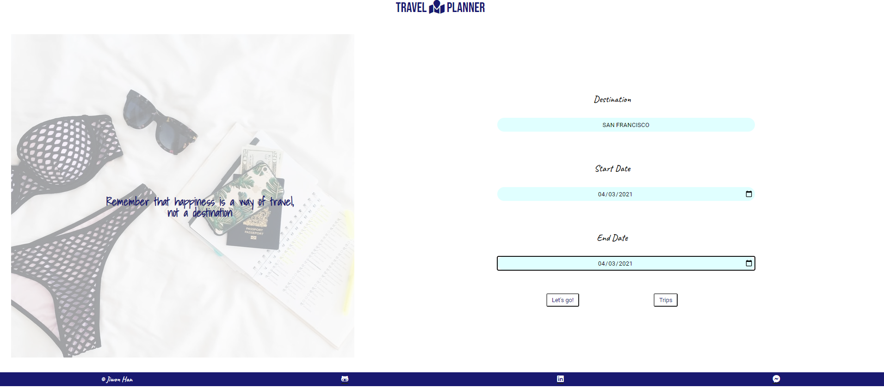
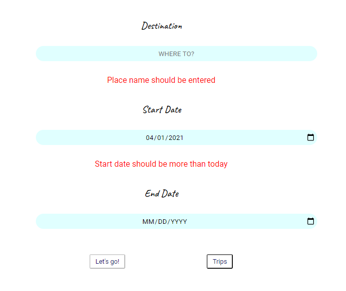
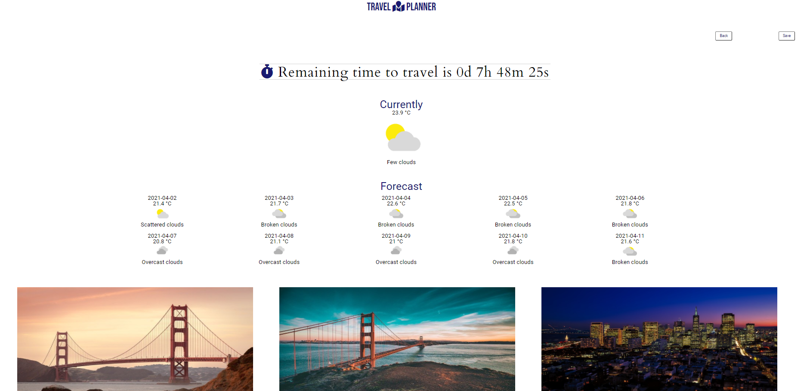
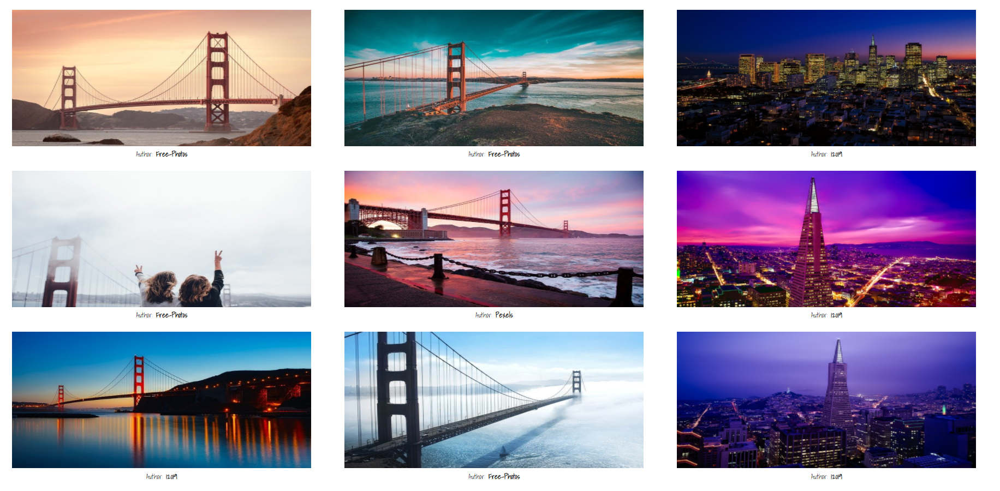
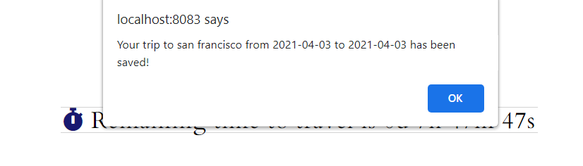

# Travel Planner

#### By **Jiwon Han**

## Table of Contents

* [Instructions](#instructions)
* [Getting Started](#Getting Started)
* [Technologies](#Technologies)
* [Contact](#Contact)
* [License](#License)

## Instructions

A Udacity front-end <strong> Capstone </strong> <em> Travel Planner </em> project.<br/>

 

This Travel Planner provides a platform where you can search a future destination's weather and photos.

Implemented with below specifications. 

- DOM manipulation
- Dev and Prod modes
- Webpack Loaders and Plugins
- Sass
- Babel
- Flexbox & Grid
- Service workers
- Express
- External APIs
- Basic Jest testing

### Features

1. Validations

If a user fills invalid inputs in a form, error message will be given and submit button `Let's go` won't be activated until valid inputs are received.

 

2. Countdown & Current weather and Forecast

Countdown will be displayed from the current date to departure date. <br/>

If the travel is coming within a week, current weather and forecast for your trip will be provided. If it's upcoming in more than a week, you will be able to see only weather forecast for 10 days. 

 

3. Real Photos

Photos of your destination will displayed. This gallery is created with grid images in CSS.

 

4. Save and Travel Plans

[Local Storage](https://www.taniarascia.com/how-to-use-local-storage-with-javascript/) is used for save the trip data so that when they close, then revisit the page, their information is still there. If you save the trip by clicking `Save` button, the trip will be saved to local storage. This button only allows you to save once by automatically being disabled after the click. You will also see the saved trips by clicking `Trips` in the main page. This will show you list of trips that you have saved.

 
 

## Getting Started

### To run dev mode locally:

In order to run this application, please have below external APIs.

* [Geoanames](https://www.geonames.org/)
* [Weatherbit](https://www.weatherbit.io/api)
* [Pixabay](https://pixabay.com/api/docs//)
 
You will need to put these APIs .env file. 

```
WEATHER_API_KEY = ********************
PHOTO_API_KEY = ********************
```

From terminal, put below commands.

```bash
  $ git clone https://github.com/jiwon-seattle/Travel-Planner.git
  $ npm install  
  # After successfull pkg installtion
  $ npm start
```
The production site is automatically hosted in http://localhost:8083 and server is running in http://localhost:8083. 

### To run dev mode locally:

```
npm test
```

## Technologies

- HTML
- Sass
- Node.js
- WebPack
- Express.js
- [Service Workers](https://developers.google.com/web/tools/workbox/guides/generate-service-worker/webpack)
- [Geoanames](https://www.geonames.org/)
- [Weatherbit](https://www.weatherbit.io/api)
- [Pixabay](https://pixabay.com/api/docs//)

 ## Contact
  #### Jiwon Han
  * [GitHub](https://github.com/jiwon-seattle)
  * [LinkedIn](https://www.linkedin.com/in/jiwon1han/)

 ## License

 `Travel Planner` is open source software [licensed as MIT][license].

 Copyright (c) 2021 **_Jiwon Han_**

 [license]: https://github.com/jiwon-seattle/Travel-Planner.git/blob/master/LICENSE.md
